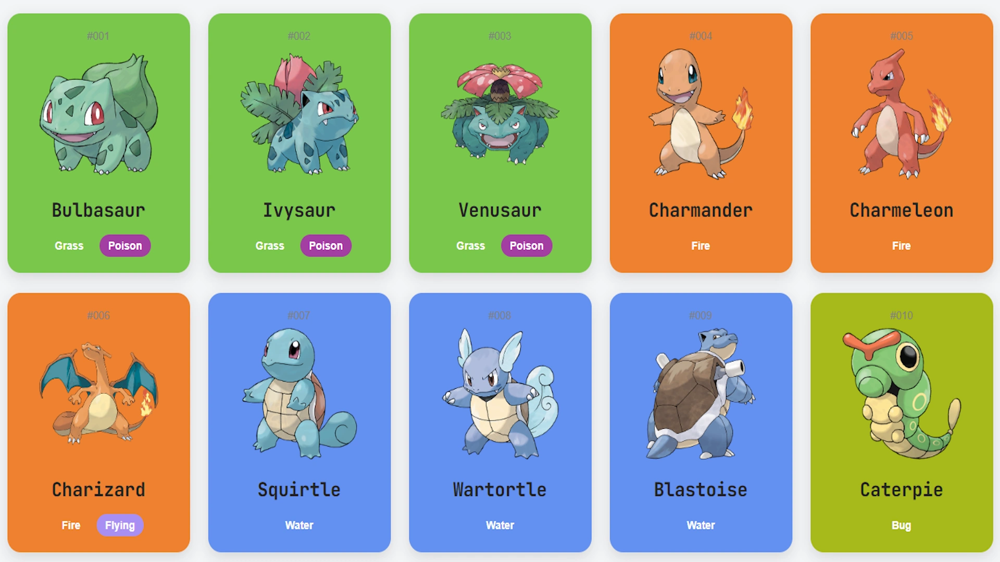
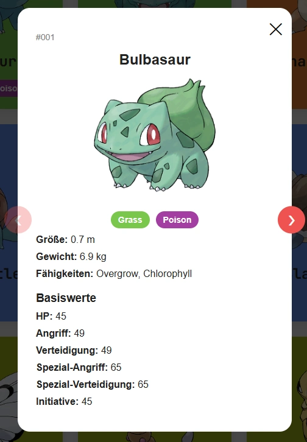

# Pokédex

A responsive Pokédex web application built with Vanilla JavaScript that fetches Pokémon data from the PokéAPI and displays it in an interactive user interface.

This project was created as a mandatory assignment during the Frontend Development course at Developer Akademie. The focus of this module was learning how to work with APIs, asynchronous JavaScript, and dynamic content rendering.

## Features

* Display Pokémon data fetched from the PokéAPI
* Search Pokémon by name
* Interactive Pokémon detail dialog
* Dynamic rendering of API data
* Responsive design for desktop and mobile devices
* Clean and user-friendly interface

## Screenshots

### Pokémon Overview

Main application view displaying Pokémon cards loaded from the API.

### Pokémon Details

Detailed Pokémon information displayed in an interactive dialog.

